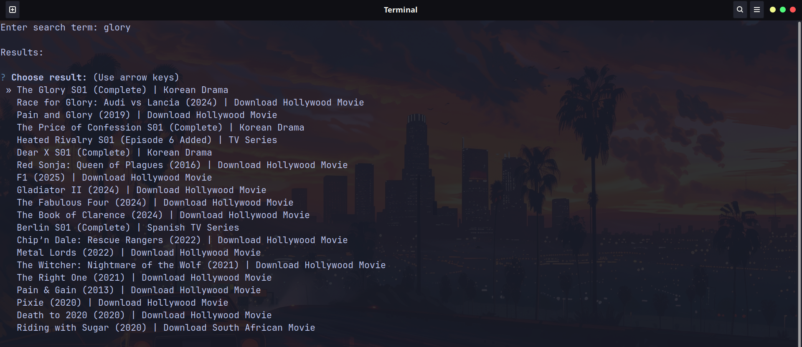

# Thenkiri-dl

**Thenkiri-dl** is a CLI tool designed to download videos from  
https://Thenkiri.com quickly and easily.

It uses **aria2** and/or **wget** to ensure fast and reliable downloads.

---

> A lightweight version should be released soon.  
> This version was developed using **Scrapy** mainly to learn the tool.

---

## Features

- Search shows available on **Thenkiri**
- Select episodes directly from the terminal
- Download using **aria2** or **wget**
- Resume interrupted downloads *(download links remain active for ~8 hours)*
- Simple CLI interface

---

## Installation

Make sure you have **aria2** and/or **wget** installed on your system.

### Clone the repository

```bash
git clone https://github.com/Nyndow/Thenkiri-dl
cd Thenkiri-dl
pip install -r requirements.txt
```

## Usage

```bash 
cd src
python main.py
```
### Search for the show


### Select the episodes you wish to download


### Download by choosing wget or aria2


