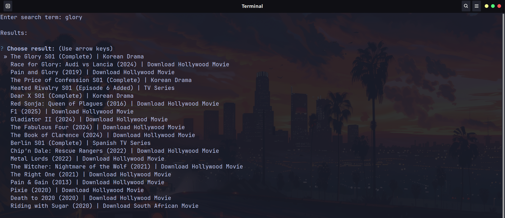
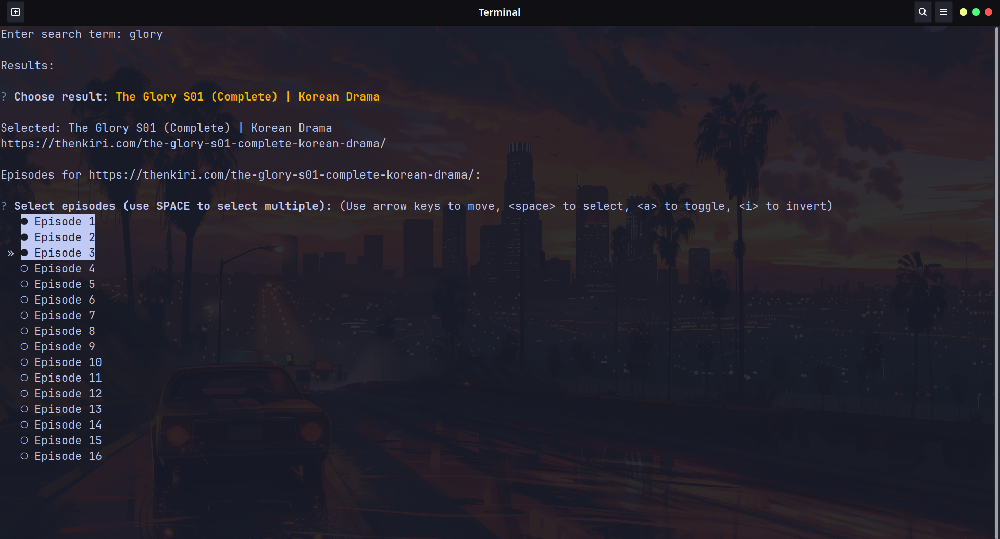
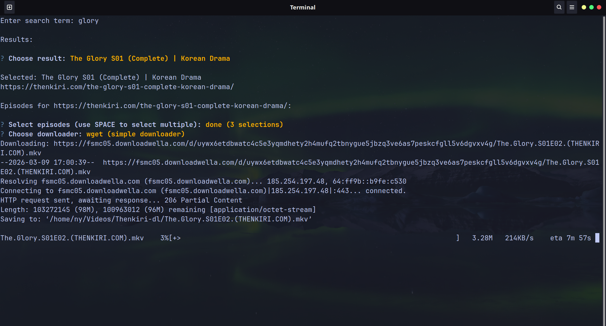

# Thenkiri-dl

**Thenkiri-dl** is a CLI tool designed to download videos from  
https://Thenkiri.com quickly and easily.

It uses **aria2** and/or **wget** to ensure fast and reliable downloads.

---

## Features

- Search shows available on **Thenkiri** and **Dramakey** 
- Select episodes directly from the terminal
- Download using **aria2** or **wget**
- Resume interrupted downloads *(download links remain active for ~8 hours)*
- Simple CLI interface
- Setting option to choose certificate checking state

---

## Installation

Choose the installation method that fits your environment.

---

### 🐳 Docker (Recommended)

Pull and run — downloaded videos and logs land in `./downloads` and `./logs`:
```bash
docker pull nyndow/thenkiri-dl:latest
docker run -it \
  -v "$PWD/downloads:/downloads" \
  -v "$PWD/logs:/app/logs" \
  nyndow/thenkiri-dl:latest
```

Prefer to build the image yourself instead of pulling from Docker Hub?
```bash
docker build -t thenkiri-dl .
docker run -it \
  -v "$PWD/downloads:/downloads" \
  -v "$PWD/logs:/app/logs" \
  thenkiri-dl
```

---

### 🛠️ Manual installation

Make sure you have **aria2** and/or **wget** installed on your system.

#### Clone the repository
```bash
git clone https://github.com/Nyndow/Thenkiri-dl
cd Thenkiri-dl
pip install -r requirements.txt
```

Create a `.env` file at the root of the directory and add:
```bash
DOWNLOAD_PATH=~/Videos/Thenkiri-dl
```

To run:
```bash 
cd src
python main.py
```

---

## Usage

### Search for the show


### Select the episodes you wish to download


### Download by choosing wget or aria2


### Setting 
If you encounter an error requiring a certificate, update yours or disable ssl from the setting (be aware of the risks)

---

## Disclaimer

This project is created for educational purposes only.  
I am not affiliated with Thenkiri.com.  
Use this tool responsibly and respect the website's terms of service.
